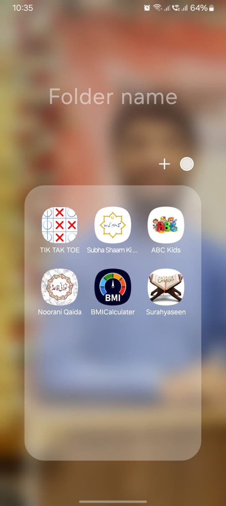
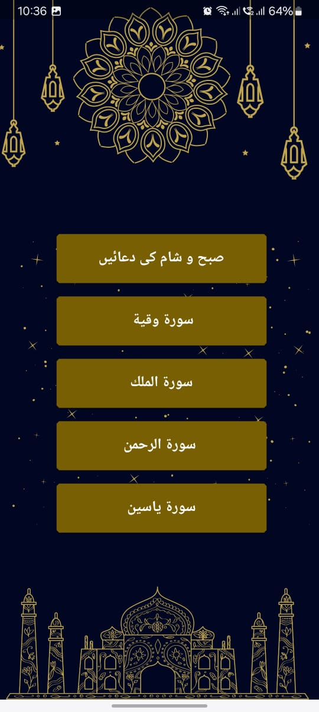
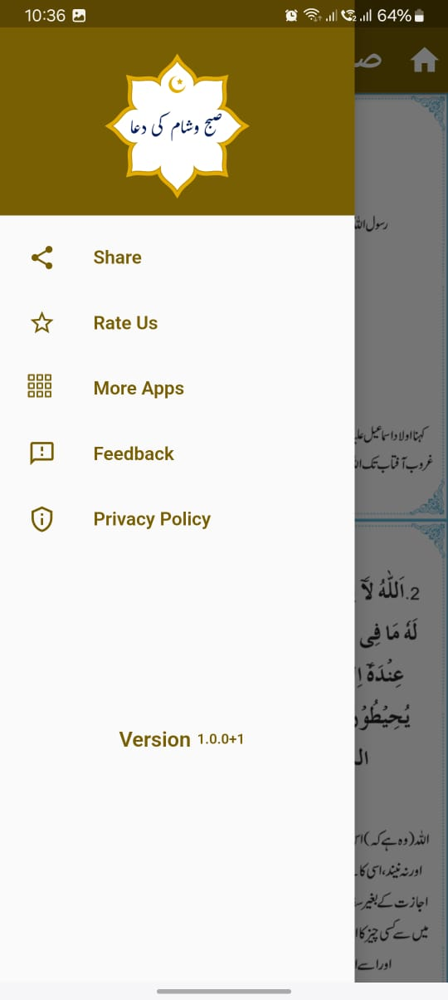

#### Subo Sham Ki Dowayn

An Islamic app to help users remember and recite daily supplications (duas). Built using **Flutter** and **Dart**, this simple app is designed to be user-friendly and supports both **Arabic** and **Urdu** languages.  this app are live on play stor        --------->       https://play.google.com/store/apps/details?id=com.devglim.Subha_Shaam_Ki_Duaain&hl=en

---

## Features

- 🌙 **Morning & Evening Duas**: A collection of daily Azkar and supplications for Subo (morning) and Sham (evening).
- 📖 **Quranic Surahs**:
  - Surah Mulk  
  - Surah Yaseen  
  - Surah Rehman  
  - Surah Waqiah  
- 📜 **Multilingual Support**: Arabic text for recitation and Urdu translations for understanding.
- 🕌 **User-Friendly Interface**: Simplistic design to ensure ease of navigation for users of all ages.

---

## Benefits

- Encourages regular remembrance of Allah through daily Azkar.
- Makes it convenient to recite Quranic Surahs anytime, anywhere.
- Helps users understand supplications with translations in Urdu.
- A perfect tool for spiritual growth and building a connection with Islam.

---
##  Screen Short
          


## Tech Stack

- **Flutter**: For a seamless cross-platform experience.
- **Dart**: Language used to build the app.

---

## How to Run

1. Clone the repository:  
   ```bash
   git clone https://github.com/your-username/subo-sham-doway.git
